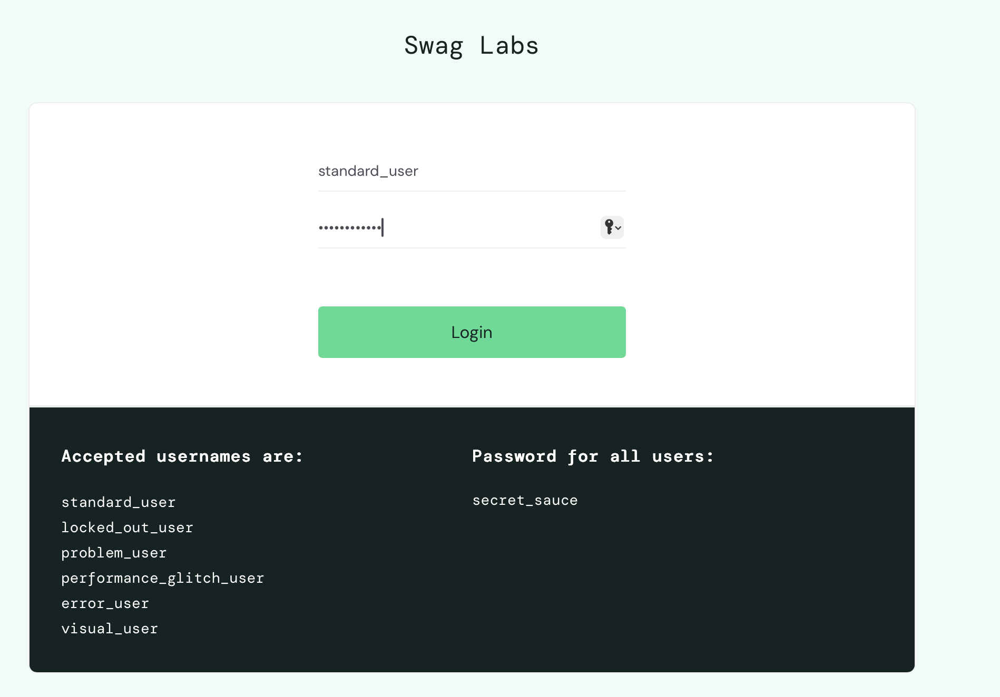
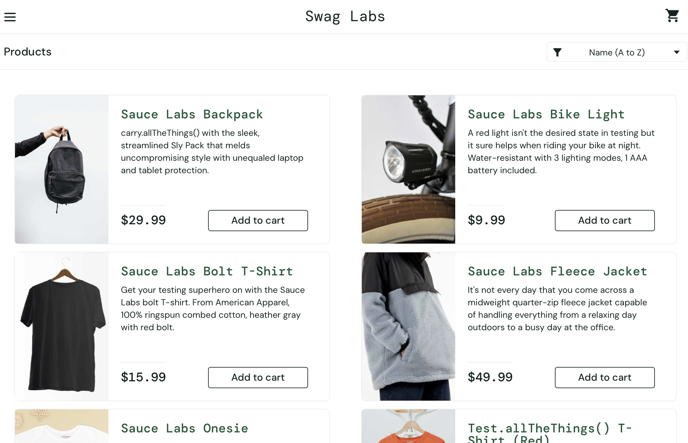
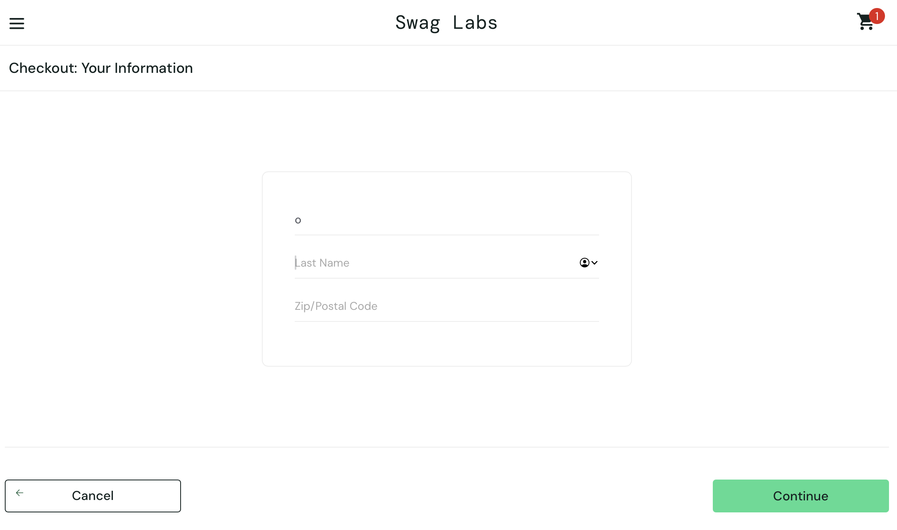

# 1. Позитивная проверка
## *Объект тестирования*
Сайт: https://www.saucedemo.com/

**Тестовые данные (предоставлены на странице):**
1. Username: standard_user
2. Password: secret_sauce

### Тест-кейс №1 — Позитивная проверка авторизации
ID: 1

Название: Успешная авторизация с валидными учетными данными

**Предусловия:**
1. Открыта страница https://www.saucedemo.com/
2. Пользователь не авторизован
3. Браузер открыт и работает корректно

**Шаги выполнения:**

| № | Действие | Ожидаемый результат | Фактический результат |
| - | --- | --- | --- |
| 1 | Открыть сайт [https://www.saucedemo.com/](https://www.saucedemo.com/) | Отображается страница авторизации | Пользователь успешно авторизован |
| 2 | Ввести в поле Username: `standard_user` | Значение отображается в поле | Отображается страница "Products" |
| 3 | Ввести в поле Password: `secret_sauce` | Пароль отображается в виде скрытых символов | Отображается список товаров |
| 4 | Нажать кнопку "Login" | Происходит переход на страницу товаров | Отсутствуют сообщения об ошибке |

# 2. Негативная проверка
## *Объект тестирования*
Сайт: https://www.saucedemo.com/

### Тест-кейс №2 — Негативная проверка поля "Last Name"
ID: 2

Название: Проверка корректности ввода данных в поле "Last Name" (под логином: problem_user)

**Предусловия:**

1. Открыт сайт https://www.saucedemo.com/
2. Выполнена авторизация под пользователем problem_user
3. Добавлен любой товар в корзину
4. Открыта страница Checkout → "Your Information"

**Шаги выполнения:**

| № | Действие | Ожидаемый результат |
| - | --- | --- |
| 1 | Ввести в поле "First Name" значение `Liza` | Значение отображается в поле First Name |
| 2 | Перейти в поле "Last Name" | Курсор устанавливается в поле Last Name |
| 3 | Ввести значение `Oshi` | Значение отображается в поле Last Name |
| 4 | Проверить содержимое обоих полей | First Name содержит `Liza`, Last Name содержит `Oshi` |

**Ожидаемый результат:**

1. Каждое поле ввода работает независимо
2. Данные отображаются в том поле, в которое производится ввод
3. Значения не перезаписываются
4. Отсутствуют визуальные или функциональные дефекты

**Фактический результат:**

1. Символы, вводимые в поле "Last Name", отображаются в поле "First Name"
2. Поле "Last Name" остается пустым
3. Поведение формы некорректное

