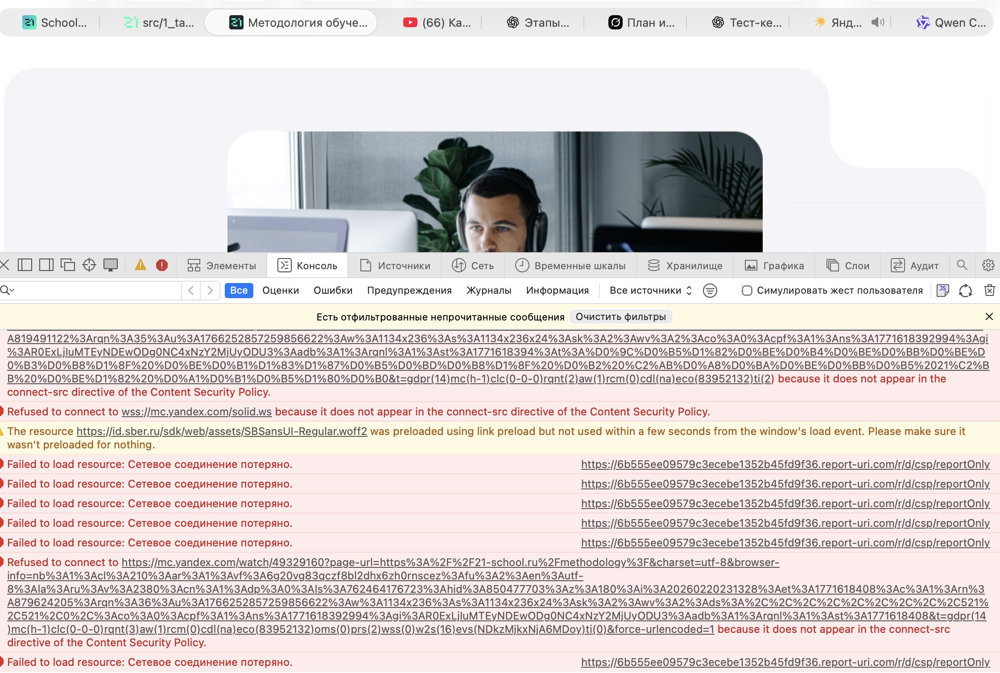

# Чек-лист для раздела «Как мы учим»
Сайт: https://21-school.ru/methodology

**UI (Визуальный интерфейс)**

1. Проверить корректность отображения цветов, шрифтов и отступов
(Убедиться, что визуальное оформление соответствует единому стилю сайта, нет «съехавших» блоков и разных шрифтов в одном разделе.)
2. Проверить корректность отображения изображений и иконок
(Убедиться, что все картинки загружаются, не искажаются, не размыты и не имеют битых ссылок.)
3. Проверить отсутствие визуальных дефектов при скролле страницы
(Нет наложения блоков, мерцания текста, «прыгающих» элементов.)
4. Проверить адаптивность раздела на мобильном устройстве (390x844)
(Текст читаемый, кнопки не выходят за границы экрана, блоки корректно перестраиваются.)

**Контент и структура**

1. Проверить наличие всех заявленных блоков раздела
(Например: Практико-ориентированный подход, Без расписаний и лекций, «Равный равному», Геймификация)
2. Проверить логичность структуры раздела
(Информация подаётся последовательно: от общего описания к деталям.)
3. Проверить отсутствие орфографических и грамматических ошибок
(Нет опечаток, дублирующихся слов, некорректных переносов.)
4. Проверить читаемость текста
(Достаточный контраст текста и фона, комфортный размер шрифта.)

**Навигация**

1. Проверить работу всех ссылок внутри раздела
(Переход осуществляется на корректные страницы без ошибок 404.)
2. Проверить работу кнопок
(Кнопки кликабельны, ведут в нужный раздел, нет «пустых» действий.)

**Интерактивность**

1. Проверить корректность анимаций
(Анимации не тормозят страницу, не перекрывают текст.)
2. Проверить поведение элементов при наведении (hover)
(Ссылки и кнопки визуально реагируют на наведение.)

**Производительность**

1. Проверить скорость загрузки раздела
(Страница загружается без длительных задержек.)
2. Проверить отсутствие ошибок в консоли браузера
(Нет критических JS-ошибок.)

**Кроссбраузерность**

1. Проверить отображение раздела в Chrome
2. Проверить отображение раздела в Safari
(Отображение и функциональность не отличаются критически.)

| Категория | Проверка | Статус | Комментарий |
| :--- | :--- | :--- | :--- |
| **UI** | Проверить корректность отображения цветов, шрифтов и отступов | Успех | - |
| **UI** | Проверить корректность отображения изображений и иконок | Успех | - |
| **UI** | Проверить отсутствие визуальных дефектов при скролле страницы | Успех  | - |
| **UI** | Проверить адаптивность раздела на мобильном устройстве (390x844) | Успех  | - |
| **Контент и структура** | Проверить наличие всех заявленных блоков раздела | Успех  | - |
| **Контент и структура** | Проверить логичность структуры раздела | Успех  | - |
| **Контент и структура** | Проверить отсутствие орфографических и грамматических ошибок | Успех | - |
| **Контент и структура** | Проверить читаемость текста | Успех | - |
| **Навигация** | Проверить работу всех ссылок внутри раздела | Успех | - |
| **Навигация** | Проверить работу кнопок | Успех  | - |
| **Интерактивность** | Проверить корректность анимаций | Успех  | - |
| **Интерактивность** | Проверить поведение элементов при наведении (hover) | Успех  | - |
| **Производительность** | Проверить скорость загрузки раздела | Успех  | - |
| **Производительность** | Проверить отсутствие ошибок в консоли браузера | Не пройдена | В консоли при перезагрузке сайта возникают ошибки(приложены в скрине) |
| **Кроссбраузерность** | Проверить отображение раздела в Chrome | Успех  | - |
| **Кроссбраузерность** | Проверить отображение раздела в Safari | Успех  | - |

