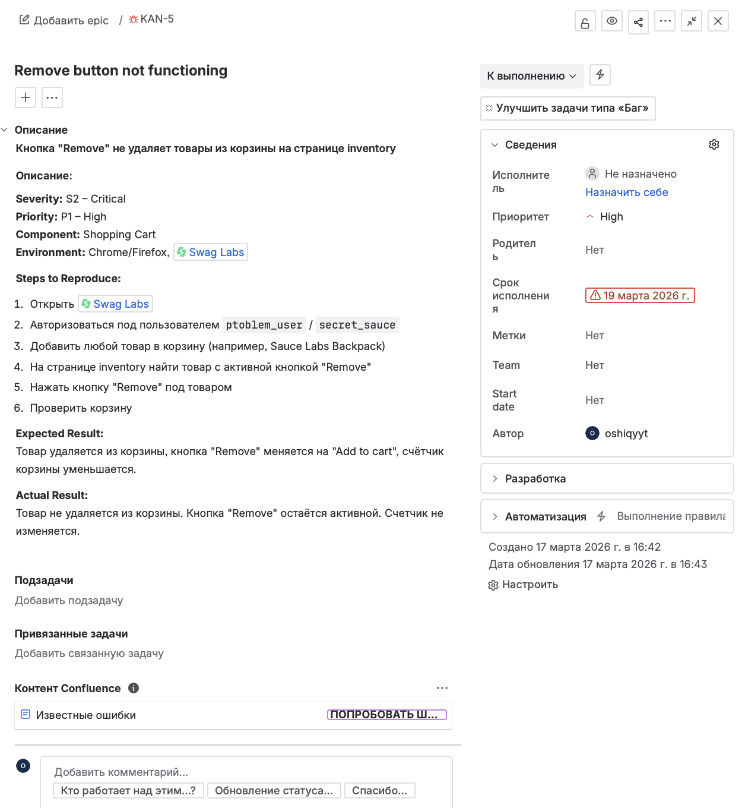

# Задание 3. Составить баг-репорт
## 1. Оформленный баг репорт в Jira

## 2. Обоснование

- Кнопка называется «Remove» (Удалить), но не выполняет своё назначение.
- Если товар нельзя удалить с главной страницы, кнопка должна быть скрыта или неактивна, а не вводить в заблуждение.
- Нет причин, по которым удаление должно работать только в одном месте.
## 3. Гипотеза о причинах (техническая часть):

### Возможная причина:

- Кнопка Remove на странице товаров не привязана к функции удаления из корзины
- Отсутствует обработчик событий (onClick) или он вызывает неправильную функцию
- Компонент не «слушает» изменения в корзине
### Точка исправления:

- Компонент InventoryItem.js или ProductCard.js
- Обработчик кнопки Remove
Что исправить: подключить корректный dispatch(removeFromCart(productId))

## 4. Влияние на пользователя и бизнес:

### Для пользователя:

- Невозможно управлять корзиной
- Приходится заходить в корзину для удаления (лишние действия)
- Разочарование: «Кнопка не работает»

### Для бизнеса:

- Пользователи могут оставить ненужные товары в корзине и отказаться от покупки
- Восприятие сайта как «сломанного»
- Снижение доверия к интерфейсу