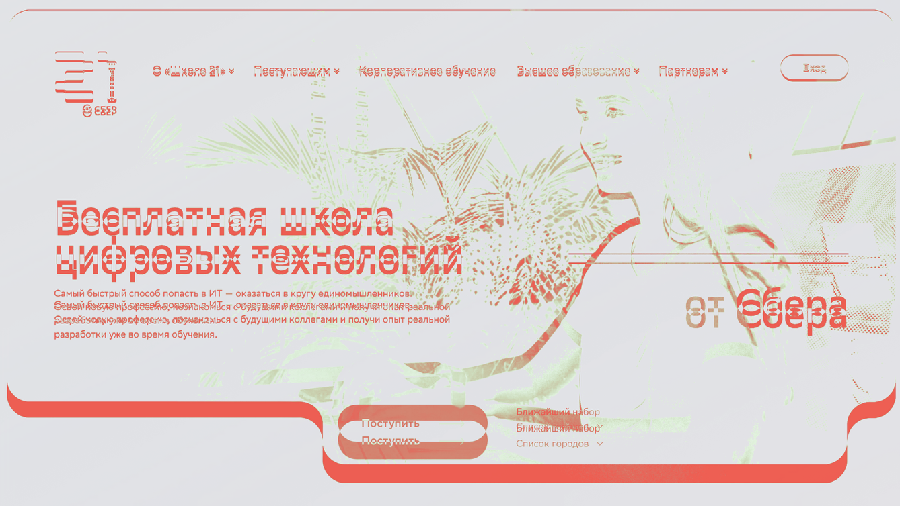
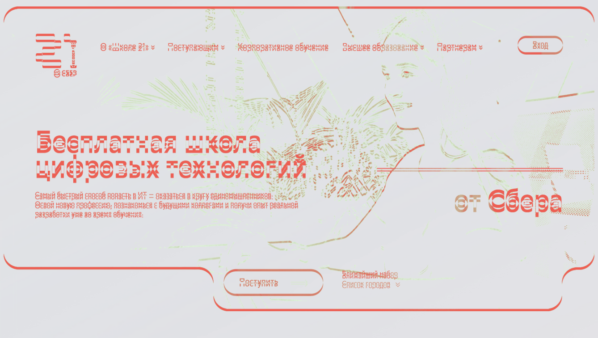

# Задание 3: Кроссбраузерное тестирование

## Браузеры для тестирования
1. **Safari** (движок WebKit)
2. **Google Chrome** (движок Blink)
3. **Mozilla Firefox** (движок Gecko)

## Таблица сравнительного анализа

| Проверяемый элемент | Конкретное отличие (Что различается и в каких браузерах) | Предполагаемая техническая причина отличия |
|--------------------|------------------------------------------------------------|--------------------------------------------|
| **1. Главный заголовок H1** «Бесплатная школа цифровых технологий» | В Safari шрифт выглядит тоньше и «мягче», в Chrome — чётче и жирнее, в Firefox — среднее начертание. Различия в сглаживании (antialiasing) | Разные движки рендеринга шрифтов: Safari (WebKit/Core Text), Chrome (Blink/DirectWrite), Firefox (Gecko). Каждый браузер применяет своё сглаживание |
| **2. Зелёная кнопка «Поступить»** | Оттенок зелёного цвета немного отличается: в Safari — ярче, в Firefox — чуть темнее на 2-3%. Скругление углов идентично | Разная обработка CSS-цветов и gamma-коррекция в браузерах. Safari может применять свою цветовую коррекцию на macOS |
| **3. Фоновое изображение** | В Firefox изображение выглядит чуть более сжатым (видны артефакты компрессии), в Safari и Chrome — качество лучше | Разные алгоритмы декодирования и масштабирования изображений WebP/JPEG в браузерах |
| **4. Текст описания** (мелкий шрифт под заголовком) | В Safari межбуквенный интервал (letter-spacing) чуть больше, текст выглядит «воздушнее». В Chrome и Firefox — плотнее | WebKit (Safari) применяет свои значения letter-spacing по умолчанию, если они не заданы явно в CSS |
| **5. Логотип «21» (SVG)** | В Chrome логотип отображается чётко, в Safari — лёгкое размытие по краям пикселей, в Firefox — идеально чёткий | Разные алгоритмы масштабирования и сглаживания SVG-графики: WebKit (CoreGraphics), Blink (Skia), Gecko |

## Скриншоты
### Safari

### Google

### FireFox

**Safari/Google**

**GoogleFireFox:**

**Safari/Firefox:**

## Рекомендации разработчикам

1. Добавить явные свойства сглаживания шрифтов
2. Использовать CSS-префиксы для всех браузеров
3. Оптимизировать изображения для всех браузеров
4. Проводить визуальное регрессионное тестирование